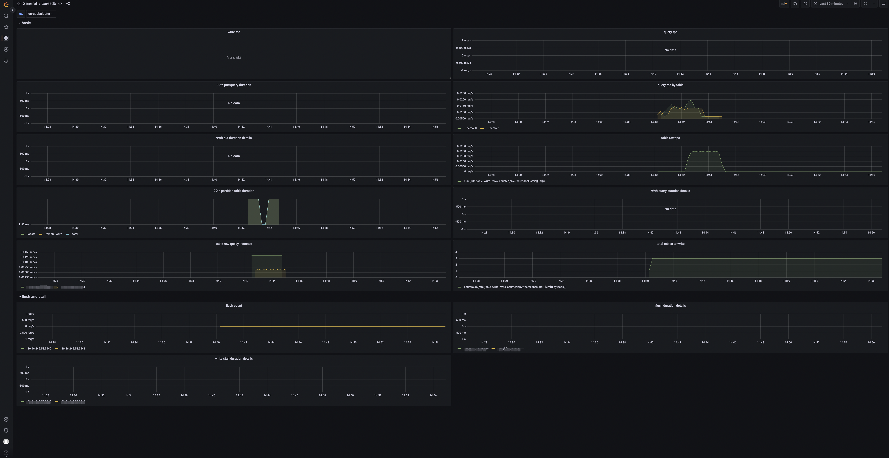

# 监控

HoraeDB 支持使用 Prometheus 和 Grafana 做自监控。

## Prometheus

[Prometheus](https://github.com/prometheus/prometheus) 是非常流行的系统和服务监控系统。

### 配置

把下面的配置保存到 `prometheus.yml` 文件中。比如，在 `tmp` 目录下，文件地址为 `/tmp/prometheus.yml`。

有两个 HoraeDB http 服务启动在 `localhost:5440`、`localhost:5441`。

```yaml
global:
  scrape_interval: 30s
scrape_configs:
  - job_name: horaedb-server
    static_configs:
      - targets: [your_ip:5440, your_ip:5441]
        labels:
          env: horaedbcluster
```

Prometheus 详细配置见[这里](https://prometheus.io/docs/prometheus/latest/configuration/configuration/)。

### 运行

你可以使用 docker 来运行 Prometheus。Docker 镜像在[这里](https://hub.docker.com/r/prom/prometheus)可以找到。

```
docker run \
    -d --name=prometheus \
    -p 9090:9090 \
    -v /tmp/prometheus.yml:/etc/prometheus/prometheus.yml \
    prom/prometheus:v2.41.0
```

更多 Prometheus 安装方法，参考[这里](https://prometheus.io/docs/prometheus/latest/installation/)。

## Grafana

[Grafana](https://github.com/grafana/grafana) 是一个非常流行的可观察性和数据可视化平台。

### 运行

你可以使用 docker 来运行 Grafana。Docker 镜像在[这里](https://hub.docker.com/r/grafana/grafana)可以找到。

```
docker run -d --name=grafana -p 3000:3000 grafana/grafana:9.3.6
```

默认用户密码是 admin/admin.

运行上面命令后，grafana 可以用浏览器打开 http://127.0.0.1:3000。

更多 Prometheus 安装方法，参考[这里](https://grafana.com/docs/grafana/latest/setup-grafana/installation/)。

### 配置数据源

1. 将光标悬停在配置（齿轮）图标上。
2. 选择数据源。
3. 选择 Prometheus 数据源。

注意: Prometheus 的 url 需要填写成这样 `http://your_ip:9090`, your_ip 换成本地地址。


更详细的配置可以参考[这里](https://grafana.com/docs/grafana/latest/datasources/prometheus/)。

### 导入监控页面

<a href="../../resources/grafana-dashboard.json">页面 json</a>


## HoraeDB 指标

当导入完成后，你可以看到如下页面：



### Panels

- tps: 集群写入请求数。
- qps: 集群查询请求数。
- 99th query/write duration: 查询写入的 99% 分位数。
- table query by table: 表查询请求数。
- 99th write duration details by instance: 写入耗时的 99% 分位数。
- 99th query duration details by instance: 查询耗时的 99% 分位数。
- 99th write partition table duration: 分区表查询耗时的 99% 分位数。
- table rows: 表的写入行数。
- table rows by instance: 实例级别的写入行数。
- total tables to write: 有数据写入的表数目。
- flush count: HoraeDB flush 的次数。
- 99th flush duration details by instance: 实例级别的 flush 耗时的 99% 分位数。
- 99th write stall duration details by instance: 实例级别的写入停顿时间的 99% 分位数 。
